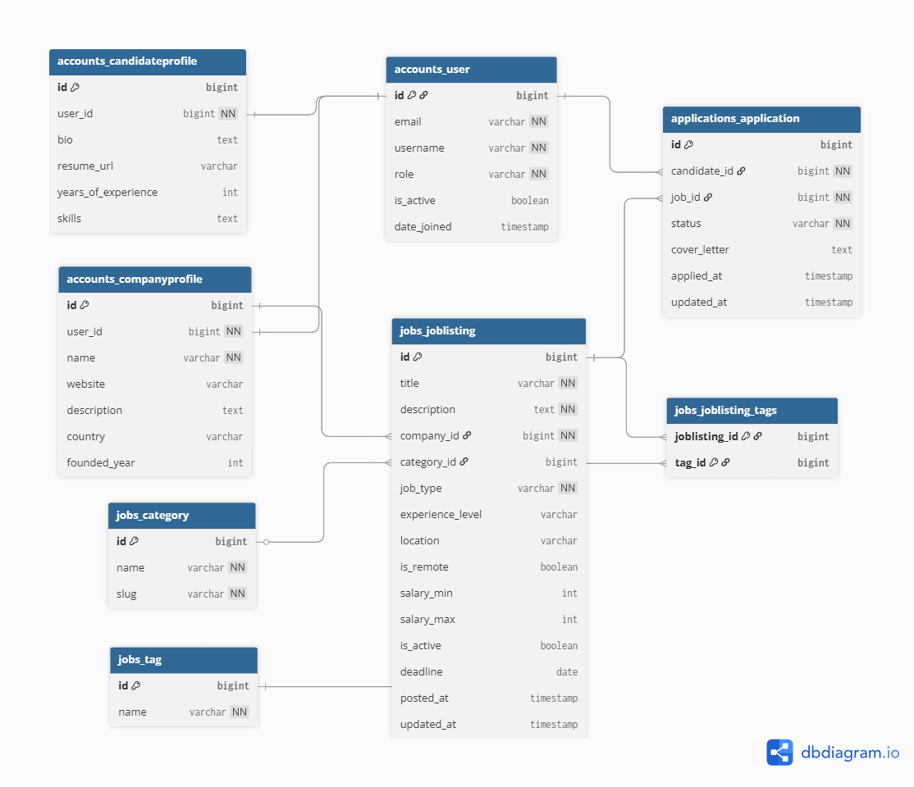
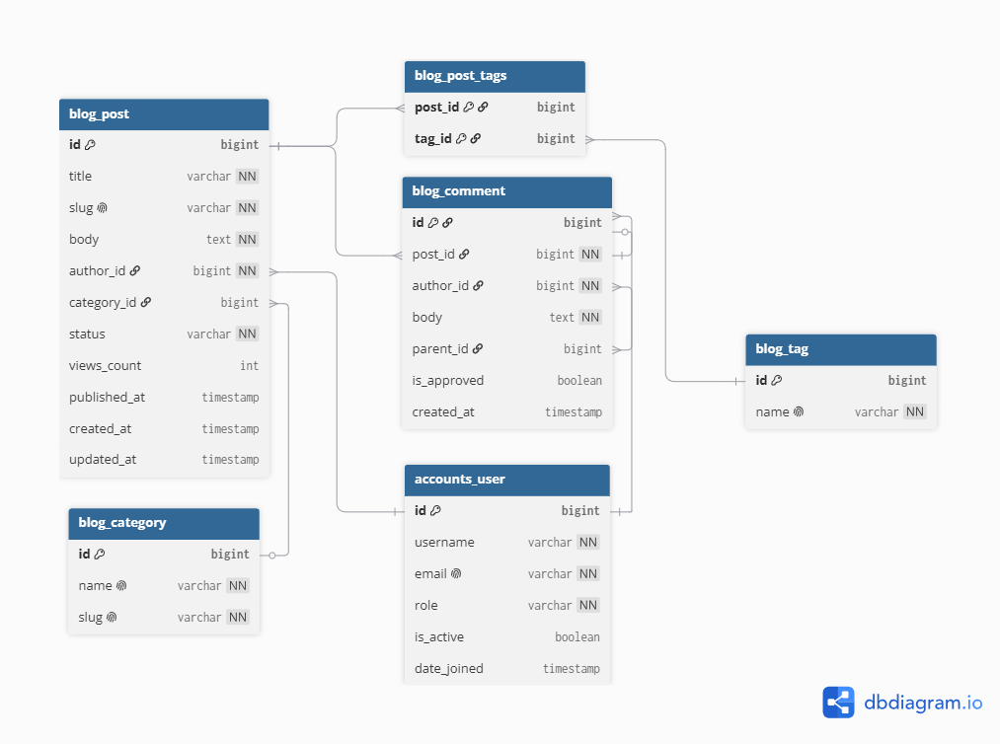

# JobBoard API

A production-ready job board REST API built with Django and Django REST Framework, targeting backend engineering roles at Japanese product companies.

## Tech Stack

- **Backend:** Python, Django, Django REST Framework
- **Database:** PostgreSQL
- **Cache & Queue:** Redis, Celery
- **Auth:** JWT (djangorestframework-simplejwt)
- **Docs:** Swagger / OpenAPI (drf-spectacular)
- **Containerization:** Docker, Docker Compose
- **CI/CD:** GitHub Actions
- **Deployment:** Railway

## Features

- [x] Multi-app architecture (accounts, jobs, applications, blog, notifications)
- [x] Custom User model with roles (company / candidate / admin)
- [x] Full model layer — job listings, applications, blog, company and candidate profiles
- [x] Database indexes for query optimisation (composite and single-column)
- [x] Django Admin with bulk actions, inlines, and custom dashboards
- [x] N+1 free queries via select_related and prefetch_related
- [x] EXPLAIN ANALYZE query plan analysis
- [x] Function-based and class-based views
- [x] Django forms with multi-level validation
- [x] Custom middleware — request logging, audit trail, maintenance mode, JSON error handling
- [x] Django signals — auto profile creation, application notifications
- [x] JWT authentication with custom claims (role, email, username)
- [x] Role-based permissions — IsCompany, IsCandidate, IsOwnerOrReadOnly
- [x] DRF serializers with read/write split and nested representations
- [x] ViewSets and Routers with custom @action endpoints
- [x] django-filter with FilterSet, SearchFilter, OrderingFilter
- [x] Custom pagination with total pages and page metadata
- [x] Redis caching with signal-based cache invalidation
- [x] Swagger / OpenAPI docs via drf-spectacular
- [x] Seed management command for reproducible test data
- [x] Dockerized with Docker Compose (web + PostgreSQL + Redis)
- [x] Async email notifications via Celery (application received, status change, welcome)
- [x] Celery worker with retry logic and Flower monitoring
- [x] 50 pytest tests passing — 83% coverage
- [x] Application system with status tracking (apply, view, status update)
- [x] Nested endpoint: GET /jobs/{id}/applications/ for company dashboard
- [ ] CI/CD pipeline with GitHub Actions
- [ ] Deployed to Railway

## Database Schema

**JobBoard Schema**


**Blog Schema**


## Project Structure
```
jobboard/
├── accounts/        # custom user model, JWT auth, company and candidate profiles
├── jobs/            # job listings, categories, tags, filtering, caching
├── applications/    # candidate applications and status tracking
├── blog/            # blog posts, comments, self-referential comment threads
├── notifications/   # email and alert system
└── docs/
├── jobboard_schema.png
└── blog_schema.png
```

## Local Setup (without Docker)

```bash
git clone https://github.com/yourusername/jobboard.git
cd jobboard
python -m venv venv

# Windows
venv\Scripts\activate

# Mac / Linux
source venv/bin/activate

pip install -r requirements.txt
cp .env.example .env   # fill in your values
python manage.py migrate
python manage.py seed_data
python manage.py createsuperuser
python manage.py runserver
```

## Local Setup (with Docker)

```bash
git clone https://github.com/yourusername/jobboard.git
cd jobboard
cp .env.example .env   # fill in your values
docker-compose up --build
docker-compose exec web python manage.py migrate
docker-compose exec web python manage.py seed_data
docker-compose exec web python manage.py createsuperuser
```

## Environment Variables
```
DJANGO_SECRET_KEY=your_secret_key
DEBUG=True
DB_NAME=jobboard_db
DB_USER=postgres
DB_PASSWORD=your_password
DB_HOST=localhost
DB_PORT=5432
REDIS_URL=redis://127.0.0.1:6379/0
```

## API Documentation

Interactive API documentation available at:

- **Swagger UI:** http://localhost:8000/api/schema/swagger-ui/
- **ReDoc:** http://localhost:8000/api/schema/redoc/
- **OpenAPI Schema:** http://localhost:8000/api/schema/

## Key API Endpoints
```
POST   /api/v1/accounts/token/              # login — returns JWT tokens
POST   /api/v1/accounts/register/candidate/ # register as candidate
POST   /api/v1/accounts/register/company/   # register as company
GET    /api/v1/accounts/me/                 # current user profile
GET    /api/v1/jobs/                        # list jobs (filterable, searchable)
POST   /api/v1/jobs/                        # create job (company only)
GET    /api/v1/jobs/{id}/                   # job detail
PATCH  /api/v1/jobs/{id}/                   # update job (owner only)
DELETE /api/v1/jobs/{id}/                   # soft delete (owner only)
GET    /api/v1/jobs/featured/               # top 5 highest paying jobs
GET    /api/v1/jobs/{id}/similar/           # jobs in same category
GET    /api/v1/jobs/categories/             # all categories (Redis cached)
```

## Testing

```bash
docker-compose exec web pytest tests/ -v --cov=. --cov-report=term-missing
```

**59 tests passing · 85% coverage**

| Area | Tests |
|---|---|
| Job listings — CRUD, permissions, filtering, N+1 | 22 tests |
| Authentication — JWT, registration, profiles | 15 tests |
| Applications — apply, signals, email tasks | 8 tests |
| Redis cache — invalidation, hit/miss | 4 tests |
| Celery tasks — email, job expiry | 1 test |

## Project Status

Actively in development. New features added regularly.