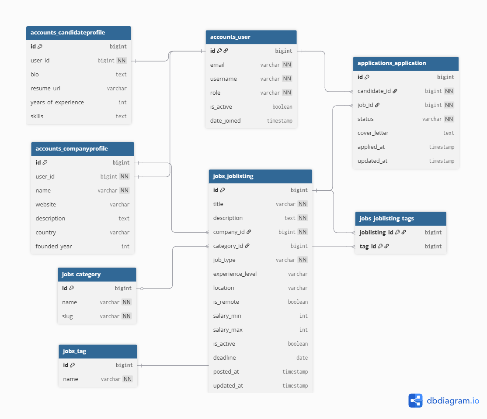
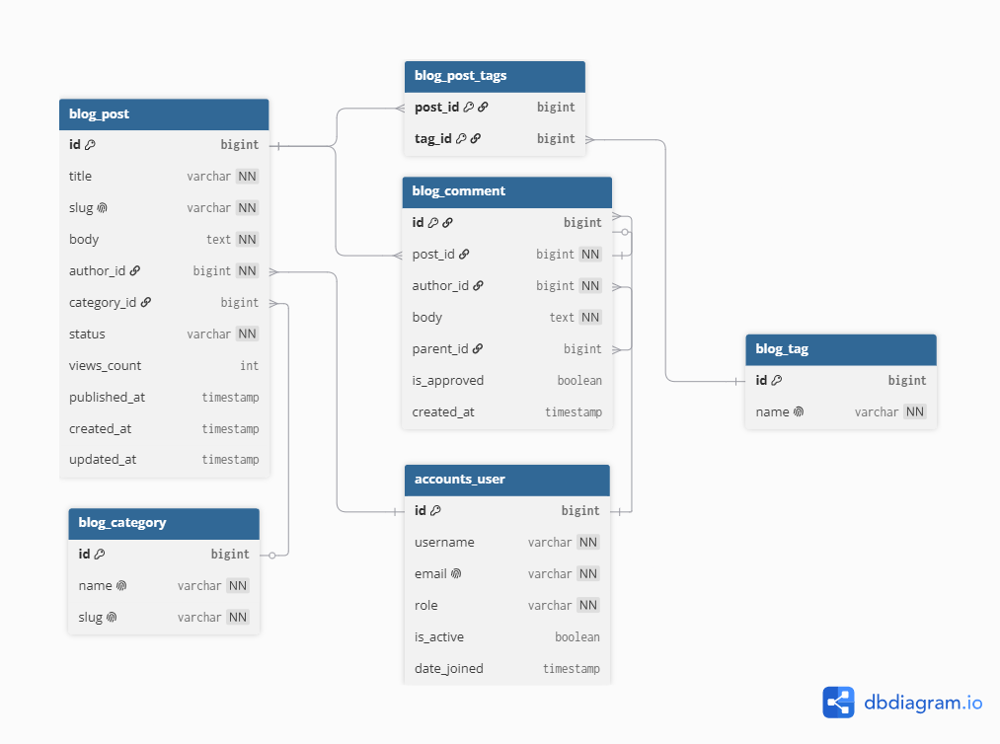

# JobBoard API

[](https://github.com/Apurvastha/Jobboard/actions/workflows/ci.yml)

A production-ready job board REST API built with Django and Django REST Framework. Service 1 of a three-service backend system — paired with a [notification-service](https://github.com/Apurvastha/notification-service) for real-time WebSocket delivery and an AI service (in development) for RAG-based job recommendations.

## Live Demo

- **Swagger UI:** https://jobboard-production-aae7.up.railway.app/api/schema/swagger-ui/
- **ReDoc:** https://jobboard-production-aae7.up.railway.app/api/schema/redoc/
- **API Base:** https://jobboard-production-aae7.up.railway.app/api/v1/
- **Admin Panel:** https://jobboard-production-aae7.up.railway.app/admin/

## Test Credentials

**Candidate account:**
- Username: `alice`
- Password: `testpass123`

**Company account:**
- Username: `mercari`
- Password: `testpass123`

**Quick start:**
1. Open [Swagger UI](https://jobboard-production-aae7.up.railway.app/api/schema/swagger-ui/)
2. `POST /api/v1/accounts/token/` with the credentials above
3. Click **Authorize** (top right lock icon) and paste the access token
4. Explore all endpoints with live data

---

## Tech Stack

- **Backend:** Python 3.11, Django 5.2, Django REST Framework
- **Database:** PostgreSQL 15
- **Cache & Queue:** Redis 7, Celery 5
- **Auth:** JWT (djangorestframework-simplejwt) with token blacklisting
- **Docs:** Swagger / OpenAPI (drf-spectacular)
- **Monitoring:** Sentry (errors + performance)
- **Containerisation:** Docker, Docker Compose
- **CI/CD:** GitHub Actions → Railway (auto-deploy on green CI)
- **Deployment:** Railway

---

## System Architecture

This service is one of three in a cohesive backend system:

```
JobBoard (Django/DRF)          ai-service (FastAPI)        notification-service (FastAPI)
        |                              |                              |
        |--- jobs/applications ------->|                              |
        |                              |--- RAG answers (SSE) ------->|
        |                              |--- agent results ----------->|
        |<-- Celery tasks --------------|                              |
        |                              |                              |--- WebSocket push
```

**Identity model:** JobBoard is the single identity source. It mints all JWTs. The notification-service holds the same secret purely to verify — never to issue. One password, one place it lives.

**Two notification producers, two audiences:**
- Status change on an application → candidate notified in real time
- New application submitted → company notified in real time

Both use the same Celery → HTTP POST → WebSocket pipeline. The notification-service earns its existence as a separate microservice through failure isolation and independent scaling — not just feature separation.

---

## Features

- [x] Multi-app architecture (accounts, jobs, applications, blog, notifications)
- [x] Custom User model with roles (company / candidate / admin)
- [x] Full model layer — job listings, applications, blog, company and candidate profiles
- [x] Database indexes for query optimisation (composite and single-column)
- [x] Django Admin with bulk actions, inlines, and custom dashboards
- [x] N+1 free queries via select_related and prefetch_related (EXPLAIN ANALYZE verified)
- [x] Custom middleware — request logging, audit trail, maintenance mode, JSON error handling
- [x] Django signals — auto profile creation, application notifications, cache invalidation
- [x] JWT authentication with custom claims (role, email, username embedded in token)
- [x] JWT token blacklisting — logout invalidates tokens server-side immediately
- [x] Redis-based access token revocation — JTI blacklist with auto-expiring TTL (~0.1ms lookup)
- [x] Token rotation — stolen refresh tokens detected and invalidated automatically
- [x] Role-based permissions — IsCompany, IsCandidate, IsOwnerOrReadOnly
- [x] DRF serializers with read/write split and nested representations
- [x] ViewSets and Routers with custom @action endpoints (featured, similar, applications)
- [x] django-filter with FilterSet, SearchFilter, OrderingFilter
- [x] Custom pagination with total pages and page metadata
- [x] Redis caching with signal-based invalidation and mutex locks to prevent cache stampede
- [x] Rate limiting — 5/min on login, 100/day unauthenticated, 1000/day authenticated
- [x] Security headers — HSTS, XSS protection, clickjacking prevention, secure cookies
- [x] Health check endpoint at /health/
- [x] Sentry error monitoring — Django, Celery, and Redis integrations
- [x] Async email notifications via Celery (application received, status change, welcome)
- [x] Celery worker with retry logic (max 3 retries, 60s backoff) and `EMAIL_TIMEOUT=5`
- [x] Celery Beat scheduled tasks (nightly job expiry, weekly digest, daily reminders)
- [x] Celery concurrency set to 2 — prevents OOM on constrained Railway dynos
- [x] Application status lifecycle (pending → reviewing → accepted/rejected)
- [x] Real-time notification pipeline: Celery → HTTP POST → notification-service → WebSocket
- [x] Two notification event types: status change (to candidate) and new application (to company)
- [x] Nested endpoint: GET /jobs/{id}/applications/ for company dashboard
- [x] 70 pytest tests passing — 84% coverage
- [x] GitHub Actions CI pipeline — tests + linting on every push
- [x] Deployed to Railway with automatic CD pipeline

---

## Notification Service Integration

JobBoard fires notifications to a dedicated [notification-service](https://github.com/Apurvastha/notification-service) — a FastAPI microservice handling real-time delivery, notification storage, and WebSocket push.

**Live:** https://notification-service-production-ae8f.up.railway.app/docs

### Shared JWT — one identity source

Both services share the same JWT signing secret. JobBoard mints all tokens. The notification-service verifies them but never issues its own. A candidate logs in once; the same token authenticates API calls to JobBoard and WebSocket connections to the notification-service.

This design closes a class of bugs: two independent ID spaces (one per service) would drift silently under load. One identity source, one place a password ever lives.

### Event type 1 — status change (company → candidate)

```
Company PATCHes /api/v1/applications/{id}/status/
  → Django signal detects old vs new status (created=False branch)
  → Celery fires send_notification_to_service.delay()
  → Worker POSTs to notification-service /notifications/ with candidate's user_id
  → Notification stored in PostgreSQL
  → WebSocket push to candidate's active connection
```

### Event type 2 — new application (candidate → company)

```
Candidate POSTs /api/v1/applications/
  → Django signal fires on created=True
  → Celery fires send_new_application_notification.delay()
  → Worker POSTs to notification-service /notifications/ with company's user_id
  → Notification stored in PostgreSQL
  → WebSocket push to company's active connection
```

### Test the pipeline

```bash
# 1. get a company token from JobBoard
curl -X POST https://jobboard-production-aae7.up.railway.app/api/v1/accounts/token/ \
  -H "Content-Type: application/json" \
  -d '{"email": "hire@mercari.com", "password": "testpass123"}'

# 2. connect WebSocket as the company (watching for new applications)
wscat -c "wss://notification-service-production-ae8f.up.railway.app/ws/notifications?token=<company_token>"

# 3. in another terminal, apply as a candidate
curl -X POST https://jobboard-production-aae7.up.railway.app/api/v1/applications/ \
  -H "Authorization: Bearer <candidate_token>" \
  -H "Content-Type: application/json" \
  -d '{"job": 198}'

# → WebSocket push arrives in the company terminal within seconds
```

---

## Key Design Decisions

| Decision | Rationale |
|---|---|
| Redis JWT revocation (JTI blacklist) | Immediate token invalidation on logout — stateless JWT cannot be revoked without a revocation store |
| Cache-stampede protection (mutex + retry loop) | Thundering herd on popular job pages; fixed-sleep fallback caused regression — replaced with 3-attempt retry loop with 10ms interval |
| Celery `--concurrency=2` | Default prefork (48 workers) OOMs Railway's constrained dynos |
| `EMAIL_TIMEOUT=5` | Without it, fake SMTP credentials hang Celery workers indefinitely |
| Direct `.delay()` over `transaction.on_commit` | Unreliable with gunicorn + Celery in the same container |
| Explicit `CELERY_BROKER_URL` with `/0` suffix | Railway's default `REDIS_URL` has no DB index — causes silent failure |
| Notification-service as separate service | Must tolerate caller failure independently; different scaling profile; failure isolation |
| Shared JWT secret (verify-only in notification-service) | One identity source across the whole system — notification-service holds the secret to verify, never to issue |

---

## Database Schema

**JobBoard Schema**


**Blog Schema**


---

## Project Structure

```
jobboard/
├── accounts/        # custom user model, JWT auth, logout, company and candidate profiles
├── jobs/            # job listings, categories, tags, filtering, caching, Beat tasks
├── applications/    # candidate applications, status lifecycle, notification pipeline
├── blog/            # blog posts, comments, self-referential comment threads
├── notifications/   # notification app (stub — delivery handled by notification-service)
├── tests/
│   ├── conftest.py
│   ├── test_jobs.py
│   ├── test_accounts.py
│   ├── test_applications.py
│   └── test_cache.py
└── docs/
    ├── jobboard_schema.png
    └── blog_schema.png
```

---

## Local Setup (with Docker)

```bash
git clone https://github.com/Apurvastha/Jobboard.git
cd jobboard
cp .env.example .env   # fill in your values
docker-compose up --build -d
docker-compose exec web python manage.py migrate
docker-compose exec web python manage.py seed_data
docker-compose exec web python manage.py createsuperuser
```

Visit:
- API: http://localhost:8000/api/v1/jobs/
- Swagger: http://localhost:8000/api/schema/swagger-ui/
- Admin: http://localhost:8000/admin/
- Flower: http://localhost:5555/

## Local Setup (without Docker)

```bash
git clone https://github.com/Apurvastha/Jobboard.git
cd jobboard
python -m venv venv

# Windows
venv\Scripts\activate

# Mac / Linux
source venv/bin/activate

pip install -r requirements.txt
cp .env.example .env
python manage.py migrate
python manage.py seed_data
python manage.py runserver
```

> **Windows note:** native PostgreSQL on port 5432 silently intercepts connections meant for Docker's PostgreSQL container. Always use `docker-compose exec web pytest` — not native `pytest` — to avoid this class of environment mismatch.

---

## Environment Variables

```
DJANGO_SECRET_KEY=your_secret_key
DEBUG=True
DB_NAME=jobboard_db
DB_USER=postgres
DB_PASSWORD=your_password
DB_HOST=db
DB_PORT=5432
REDIS_URL=redis://redis:6379/0
CELERY_BROKER_URL=redis://redis:6379/0    # explicit /0 required — Railway default URL omits it
CELERY_RESULT_BACKEND=redis://redis:6379/0
EMAIL_HOST=sandbox.smtp.mailtrap.io
EMAIL_PORT=587
EMAIL_HOST_USER=your_mailtrap_username
EMAIL_HOST_PASSWORD=your_mailtrap_password
EMAIL_USE_TLS=True
DEFAULT_FROM_EMAIL=noreply@jobboard.com
NOTIFICATION_SERVICE_URL=http://localhost:8001
SENTRY_DSN=your_sentry_dsn  # optional
```

---

## Key API Endpoints

```
Authentication
  POST   /api/v1/accounts/token/              # login — returns JWT access + refresh tokens
  POST   /api/v1/accounts/token/refresh/      # refresh access token (rotates refresh token)
  POST   /api/v1/accounts/logout/             # logout — blacklists refresh token immediately
  POST   /api/v1/accounts/register/candidate/ # register as candidate
  POST   /api/v1/accounts/register/company/   # register as company
  GET    /api/v1/accounts/me/                 # current user info

Jobs
  GET    /api/v1/jobs/                        # list jobs (filterable, searchable, paginated)
  POST   /api/v1/jobs/                        # create job (company only)
  GET    /api/v1/jobs/{id}/                   # job detail
  PATCH  /api/v1/jobs/{id}/                   # update job (owner only)
  DELETE /api/v1/jobs/{id}/                   # soft delete (owner only)
  GET    /api/v1/jobs/featured/               # top 5 highest paying jobs
  GET    /api/v1/jobs/{id}/similar/           # jobs in same category
  GET    /api/v1/jobs/{id}/applications/      # all applications for this job (company only)
  GET    /api/v1/jobs/categories/             # all categories (Redis cached, 1hr TTL)

Applications
  POST   /api/v1/applications/               # apply to a job (candidate only)
  GET    /api/v1/applications/               # my applications (candidate) or job apps (company)
  GET    /api/v1/applications/{id}/          # application detail
  PATCH  /api/v1/applications/{id}/status/   # change status → triggers WebSocket notification

System
  GET    /health/                             # health check — liveness probe
```

---

## Filtering & Search

```bash
GET /api/v1/jobs/?location=Tokyo&job_type=full_time&is_remote=false
GET /api/v1/jobs/?min_salary=6000000&max_salary=10000000
GET /api/v1/jobs/?search=python
GET /api/v1/jobs/?ordering=-salary_max
GET /api/v1/jobs/?page=2&page_size=10
```

---

## Load Testing & Performance

Seeded with 25,000+ synthetic job postings, load-tested with Locust, validated with `EXPLAIN ANALYZE`.

### Index verification at scale

| Query | Plan | Time |
|---|---|---|
| `is_active + posted_at`, ordered, `LIMIT 20` | Index Scan Backward | 0.45ms |
| `location = 'Tokyo'` | Bitmap Heap Scan | 2.3ms |
| `salary_min >= 6000000` | Seq Scan (correct — ~55% selectivity) | 6.8ms |
| `description LIKE '%word%'` | Seq Scan (no B-tree index can serve leading wildcard) | 7.7ms |

The salary query is the interesting one: at ~55% selectivity, Postgres correctly ignores the index in favour of a sequential scan — verified via planner cost output. The LIKE query previews why the planned AI service needs full-text search (GIN + `pg_trgm` or `tsvector`) rather than relying on Postgres defaults.

### Concurrency load testing

| Concurrent users | Median | p95 | RPS | Failures |
|---|---|---|---|---|
| 10 | 31ms | 160ms | 27.8 | 0 |
| 50 | 290ms | 710ms | 56.6 | 0 |
| 100 | 690ms | 2500ms | 80.7 | 2 / 14,756 |

The 2 failures at 100 users were `FATAL: sorry, too many clients already` — Postgres `max_connections` briefly exhausted. Root cause: local dev has no `CONN_MAX_AGE`, so every request opens a fresh connection. Production sets `conn_max_age=600`.

### Cache-stampede fix

The mutex lock was making things slower (410ms median vs 240ms unprotected). Root cause: fixed `time.sleep(0.1)` fallback — every waiter paid the full 100ms even when data was ready in 10–20ms. Also found a correctness bug: `self.get_serializer(instance)` instead of `.data`, returning a serializer object into `Response()` instead of serialized data.

Fix: replaced fixed sleep with 3-attempt retry loop (10ms interval), fixed the `.data` bug.

| | Before | After |
|---|---|---|
| Median | 410ms | 310ms |
| Max | 608ms | 471ms |

---

## Testing

```bash
docker-compose exec web pytest tests/ -v --cov=. --cov-report=term-missing
```

**70 tests passing · 84% coverage**

| Area | Tests |
|---|---|
| Job listings — CRUD, permissions, filtering, N+1 | 22 |
| Authentication — JWT, registration, logout, profiles | 22 |
| Applications — apply, status change, permissions, notification tasks | 15 |
| Redis cache — invalidation, hit/miss, stampede-lock contention | 6 |
| Celery tasks — email, job expiry | 5 |

---

## CI/CD Pipeline

```
Push to GitHub
    ↓
GitHub Actions — spin up PostgreSQL + Redis
    ↓
Run migrations + check for missing migrations
    ↓
Run 70 pytest tests (fail if coverage < 70%)
    ↓
Run Ruff linter
    ↓
Deploy to Railway (only if all steps pass)
    ↓
Live at https://jobboard-production-aae7.up.railway.app
```

---

## Project Status

Service 1 of 3 — complete. Paired with [notification-service](https://github.com/Apurvastha/notification-service). AI service in development.